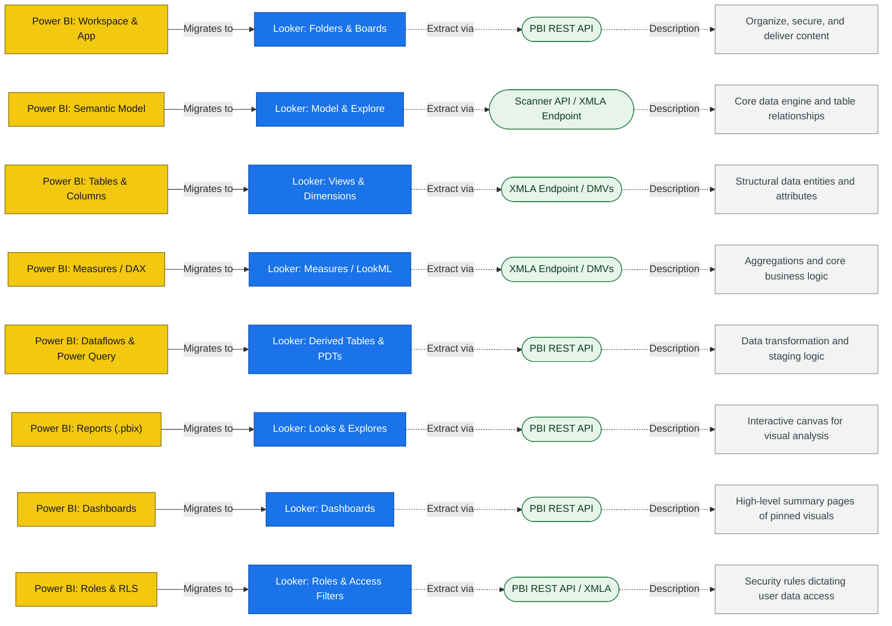

# Power BI → Looker migration — project source of truth

> **This file is the single source of truth for this repository.** Use it as the shared reference for **what will be built**, **which decisions apply**, and **how the pieces connect**: Power BI and Looker objects, migration workflows, APIs, staging schema, DAX→LookML approach, pipeline steps, and agent boundaries. **Developers** should align implementation and smaller docs with it. **Agents** should use it for scope, constraints, and what each role owns. When plans or behavior change, update this document (or add an explicit decision note here) so the repo stays one coherent story.

## How to use this document

| You need… | Go to… |
| --------- | ------ |
| End-to-end picture (diagrams) | [Migration mapping overview](#migration-mapping-overview) |
| One diagram edge: objects, endpoints, caveats | [Migration workflows (Power BI to Looker)](#migration-workflows-power-bi-to-looker) |
| Concept-level Power BI ↔ Looker mapping | [Section 1 — Content mapping](#1-content-mapping-power-bi-to-looker) |
| REST / Scanner / XMLA / tools; per-type extract | [Sections 2–3](#2-programmatic-access-methods) |
| MariaDB staging contract | [Section 4](#4-mariadb-staging-schema) |
| DAX → LookML strategy | [Section 5](#5-dax-to-lookml-translation) |
| Runnable pipeline order (assessment, extract, rationalize) | [Section 6 — Pipeline implementation](#6-pipeline-implementation) |
| What each **agent** does; tools to add | [Section 7 — Migration agents](#7-migration-agents) |
| PPU / licensing | [Section 8](#8-ppu-specific-constraints) |
| Terminology; DAX / Scanner / XMLA primers | [Section 9](#9-prerequisites-and-key-concepts) |

**Related files:** [`mstr-looker-repo-reference.md`](./mstr-looker-repo-reference.md) (repo layout and patterns from the MicroStrategy program), [`runbook.md`](./runbook.md) (how to run tooling when it exists). **Day-to-day bugs and tasks** belong in whatever system the team uses for work tracking (for example GitHub Issues, Jira, or Azure DevOps); **architecture, approach, and plans** belong in this document. **Primary Jira epic/ticket for this program:** [BIP-1074](https://66degrees.atlassian.net/browse/BIP-1074).

---

## Table of Contents

- [How to use this document](#how-to-use-this-document)
- [Migration mapping overview](#migration-mapping-overview)
- [Migration workflows (Power BI to Looker)](#migration-workflows-power-bi-to-looker)
1. [Content mapping: Power BI to Looker](#1-content-mapping-power-bi-to-looker)
2. [Programmatic access methods](#2-programmatic-access-methods)
3. [Extraction strategy per content type](#3-extraction-strategy-per-content-type)
4. [MariaDB staging schema](#4-mariadb-staging-schema)
5. [DAX-to-LookML translation](#5-dax-to-lookml-translation)
6. [Pipeline implementation](#6-pipeline-implementation)
7. [Migration agents](#7-migration-agents)
8. [PPU-specific constraints](#8-ppu-specific-constraints)
9. [Prerequisites and key concepts](#9-prerequisites-and-key-concepts)

---

## Migration mapping overview



**Lucidchart:** [Migration architecture diagram](https://lucid.app/lucidchart/a4f92d43-915f-4da9-a6f7-eb5ebf5e6890/edit?viewport_loc=4770%2C3989%2C959%2C2557%2C0_0&invitationId=inv_efa6f103-d06d-497c-87e3-54170df63f42) (sign-in or invite may be required).

---

## Migration workflows (Power BI to Looker)

Each edge in the mapping diagram is a **workflow**: discover and extract Power BI metadata, load a staging store (MariaDB), transform, then deploy to Looker. This section ties **objects**, **endpoints**, and **constraints** to that diagram. Step-level extraction order is in Section 3; relational staging in Section 4. Agents that own these workflows are listed in Section 7.

### Workspace and App → Folders and Boards

| Aspect | Detail |
| ------ | ------ |
| **Power BI** | Workspaces (`groups`), membership, roles (Admin / Member / Contributor / Viewer); **apps** as packaged distributions with audiences. |
| **Looker** | Folders, folder permissions, **Boards** where the target org uses them for curated navigation. |
| **Endpoints** | `GET /v1.0/myorg/groups`; `GET /v1.0/myorg/groups/{groupId}/users`; admin: `GET /v1.0/myorg/admin/groups`. Apps: admin/app routes per [Power BI REST](https://learn.microsoft.com/en-us/rest/api/power-bi/) (confirm for your tenant SKU). |
| **Caveats** | A report’s workspace is not always its **dataset** workspace: resolve `datasetId` → home workspace before mapping folder/explore ownership. Capacity assignment affects Premium features, not basic catalog listing. |

### Semantic Model → Model and Explore

| Aspect | Detail |
| ------ | ------ |
| **Power BI** | Semantic model (dataset): tables at logical level, refresh, default storage mode hints, relationships (via XMLA). |
| **Looker** | Project **model** files, **explores**, `connection` / `sql_table_name` strategy. |
| **Endpoints** | Scanner: `POST /admin/workspaces/getInfo` with `datasetSchema` and `datasetExpressions`. XMLA: `powerbi://api.powerbi.com/v1.0/myorg/{WorkspaceName}`. Optional file path: BIM JSON (Section 2.7). |
| **Caveats** | Build a **tenant dataset catalog** (`datasetId` → owning workspace) before foreign keys from reports to `semantic_*` rows. XMLA R/W on a model can block PBIX export for dependent reports (Section 2.8) while leaving Scanner/XMLA metadata available. |

### Tables and Columns → Views and Dimensions

| Aspect | Detail |
| ------ | ------ |
| **Power BI** | Data columns, **calculated columns** (DAX), hierarchies, display folders, hidden fields / OLS. |
| **Looker** | `view`, `dimension`, `drill_fields`, `group_label`. |
| **Endpoints** | Scanner: `workspaces[].datasets[].tables[]`, `columns[]`. XMLA DMVs: `TMSCHEMA_TABLES`, `TMSCHEMA_COLUMNS`, `TMSCHEMA_HIERARCHIES`, `TMSCHEMA_LEVELS`. |
| **Caveats** | Calculated columns are **row-level DAX**; they often become SQL dimensions or upstream ETL, not passive attribute maps. OLS maps to Looker `hidden` / access grants, not a single REST flag. |

### Measures and DAX → Measures and LookML

| Aspect | Detail |
| ------ | ------ |
| **Power BI** | Measures, format strings, display folders. |
| **Looker** | `measure`, `filtered_measure`, or **derived tables / PDTs** when logic is iterator- or subquery-shaped. |
| **Endpoints** | Scanner: `measures[].expression`. XMLA: `TMSCHEMA_MEASURES`. Optional validation: `POST /datasets/{id}/executeQueries`. |
| **Caveats** | DAX **filter context** (`CALCULATE`, iterators, time intelligence) has no direct LookML twin; use deterministic parse → classify → Rosetta rules, with LLM only for residual gaps (Section 5). |

### Dataflows and Power Query → Derived Tables and PDTs

| Aspect | Detail |
| ------ | ------ |
| **Power BI** | Dataflows, entities, **M** mashup. |
| **Looker** | `derived_table`, PDTs, or warehouse ETL outside Looker. |
| **Endpoints** | `GET /groups/{groupId}/dataflows`; `GET /dataflows/{id}`; admin export where licensed. Scanner can include dataflow-related metadata depending on options. |
| **Caveats** | Looker does not execute M; plan rewrite to SQL/dbt/PDT or keep transformations in the database layer the model queries. |

### Reports (.pbix) → Looks and Explores

| Aspect | Detail |
| ------ | ------ |
| **Power BI** | Report pages, visuals, filters, bookmarks; optional PBIR inside exported PBIX. |
| **Looker** | Looks, dashboard elements, LookML or user-defined dashboards. |
| **Endpoints** | `GET /groups/{groupId}/reports/{reportId}/pages`; `POST .../reports/{reportId}/ExportTo` (PBIX). Offline: `pbi-tools` / PBIR parsers. Catalog: Scanner `reports[]` slice. |
| **Caveats** | Treat PBIX export as **best-effort**: XMLA R/W history can disable export permanently for some reports (Section 2.8). Persist `export_status` per report and fall back to scaffolds or alternate PBIR sources. |

### Dashboards → Dashboards

| Aspect | Detail |
| ------ | ------ |
| **Power BI** | Dashboards; **tiles** referencing report visuals; optional data alerts. |
| **Looker** | LookML dashboards, elements, alerts. |
| **Endpoints** | `GET /groups/{groupId}/dashboards`; `GET /dashboards/{dashboardId}/tiles`. Subscriptions: admin report/dashboard subscription APIs. |
| **Caveats** | Tile lineage includes `reportId` and often `datasetId`; apply the same **cross-workspace dataset** resolution as for reports. |

### Roles and RLS → Roles and Access Filters

| Aspect | Detail |
| ------ | ------ |
| **Power BI** | RLS roles, table-permission DAX, role memberships. |
| **Looker** | `access_filter`, **user attributes**, optional `access_grant`. |
| **Endpoints** | XMLA: `TMSCHEMA_ROLES`, `TMSCHEMA_TABLE_PERMISSIONS`, `TMSCHEMA_ROLE_MEMBERSHIPS`. Scanner: role names when members are assigned (limited). |
| **Caveats** | Persist **structured** mappings from RLS DAX to columns and identity functions (`USERPRINCIPALNAME`, etc.), not only raw expressions (Section 1.2). |

---

## 1. Content mapping: Power BI to Looker

### 1.1 Semantic Model (Dataset) -> LookML Views + Model

The Power BI semantic model is the closest equivalent to the MicroStrategy schema layer (attributes, facts, metrics, logical tables). It contains tables, columns, measures, calculated columns, relationships, and hierarchies.

| Power BI Concept        | Looker Equivalent                                                                            | Notes                                                                                                                                                                                                                                                                                          |
| ----------------------- | -------------------------------------------------------------------------------------------- | ---------------------------------------------------------------------------------------------------------------------------------------------------------------------------------------------------------------------------------------------------------------------------------------------- |
| Table                   | LookML view                                                                                  | One view per table. `sql_table_name` points to the underlying source.                                                                                                                                                                                                                          |
| Column                  | `dimension`                                                                                  | Standard columns become dimensions. Data type maps to `type: string`, `number`, `yesno`, etc.                                                                                                                                                                                                  |
| Calculated column       | `dimension` with `sql:`                                                                      | The DAX expression must be translated to SQL.                                                                                                                                                                                                                                                  |
| Measure (DAX)           | `measure` with `sql:` / `type:`; sometimes `filters:` / `filtered_measure` or derived tables | Simple aggregations map directly. `CALCULATE` and iterators do **not** map 1:1—LookML has no DAX-style _filter context inside a single measure_ (see Section 5). Prefer rule-based translation to `filtered_measure`, `sql` with explicit predicates, or derived tables; use AI only when rules fail. |
| Relationship            | `join` in model file                                                                         | Foreign key relationships become `sql_on` joins. Cardinality maps to `relationship:` parameter.                                                                                                                                                                                                |
| Hierarchy               | `drill_fields`                                                                               | Hierarchies become drill-down paths on dimensions.                                                                                                                                                                                                                                             |
| Date table              | `dimension_group` with `type: time`                                                          | Auto date/time tables or explicit date tables become Looker time dimension groups.                                                                                                                                                                                                             |
| Folder (display folder) | `group_label`                                                                                | Display folders on columns map to Looker's `group_label` for organizing dimensions.                                                                                                                                                                                                            |

**Documentation:**

- [Power BI semantic model connectivity (XMLA endpoint)](https://learn.microsoft.com/en-us/power-bi/enterprise/service-premium-connect-tools)
- [LookML view reference](https://cloud.google.com/looker/docs/reference/param-view)
- [LookML dimension reference](https://cloud.google.com/looker/docs/reference/param-field-dimension)
- [LookML measure reference](https://cloud.google.com/looker/docs/reference/param-field-measure)

### 1.2 Row-Level Security (RLS) -> `access_filter` + User Attributes

| Power BI Concept            | Looker Equivalent                         | Notes                                                                                                                                                                                                                                                                                                                                                                                                                                                                                        |
| --------------------------- | ----------------------------------------- | -------------------------------------------------------------------------------------------------------------------------------------------------------------------------------------------------------------------------------------------------------------------------------------------------------------------------------------------------------------------------------------------------------------------------------------------------------------------------------------------- |
| RLS role                    | `access_filter` on explore                | Each RLS role with a DAX filter expression translates to a Looker `access_filter` block.                                                                                                                                                                                                                                                                                                                                                                                                     |
| RLS role membership         | Looker user attributes                    | Users assigned to RLS roles get corresponding user attribute values.                                                                                                                                                                                                                                                                                                                                                                                                                         |
| Dynamic RLS (DAX)           | User attributes injected into SQL `WHERE` | Power BI RLS often uses functions like `USERPRINCIPALNAME()`, `USERNAME()`, or lookups. Looker implements this by binding **user attributes** to SQL. The pipeline must **parse the RLS DAX**, identify which **physical columns** are constrained, and emit an explicit mapping: _PBI column / table → Looker user attribute name → `access_filter` qualification_. Treat this as a **deterministic extraction + mapping** problem first (patterns + Rosetta), not a free-form LLM rewrite. |
| Object-Level Security (OLS) | `hidden: yes` on fields                   | OLS hides specific columns/tables; closest Looker equivalent is hiding fields per model or using field-level access grants.                                                                                                                                                                                                                                                                                                                                                                  |

**Documentation:**

- [Power BI RLS](https://learn.microsoft.com/en-us/power-bi/enterprise/service-admin-rls)
- [Scanner API RLS metadata](https://powerbi.microsoft.com/en-ca/blog/new-scanner-api-scenarios/)
- [Looker access_filter](https://cloud.google.com/looker/docs/reference/param-explore-access-filter)
- [Looker access grants](https://cloud.google.com/looker/docs/reference/param-model-access-grant)

### 1.3 Reports -> Looks + LookML Dashboards

Power BI reports are multi-page canvases with visuals. Each page contains visuals that reference semantic model fields.

| Power BI Concept     | Looker Equivalent                         | Notes                                                                                 |
| -------------------- | ----------------------------------------- | ------------------------------------------------------------------------------------- |
| Report               | Looker dashboard (LookML or user-defined) | A report maps to a dashboard. Each page could be a separate dashboard or tab.         |
| Visual (chart/table) | Dashboard element / Look                  | Each visual maps to a dashboard tile backed by a query.                               |
| Report page          | Dashboard tab or separate dashboard       | Depends on complexity.                                                                |
| Slicer / filter      | Dashboard filter                          | Report-level and page-level filters become dashboard filters.                         |
| Bookmark             | N/A (manual)                              | No direct equivalent. Must be recreated as separate dashboard views or filtered URLs. |
| Drillthrough         | `link` parameter on dimensions            | Drillthrough pages can be approximated with Looker's `link` or `drill_fields`.        |
| Tooltip page         | N/A                                       | Custom tooltip pages have no direct Looker equivalent.                                |

**Documentation:**

- [Power BI Report REST API](https://learn.microsoft.com/en-us/rest/api/power-bi/reports)
- [Power BI PBIR format (enhanced report format)](https://learn.microsoft.com/en-us/power-bi/developer/embedded/projects-enhanced-report-format)
- [Looker LookML dashboard reference](https://cloud.google.com/looker/docs/reference/param-lookml-dashboard)
- [Looker dashboard elements](https://cloud.google.com/looker/docs/reference/param-lookml-dashboard-element)

### 1.4 Dashboards (Pinned Tiles) -> Looker Dashboards

Power BI dashboards are collections of tiles pinned from reports. They are simpler than reports.

| Power BI Concept     | Looker Equivalent | Notes                                             |
| -------------------- | ----------------- | ------------------------------------------------- |
| Dashboard            | Looker dashboard  | Direct mapping.                                   |
| Pinned tile          | Dashboard element | Each tile references a report visual.             |
| Dashboard data alert | Looker alert      | Alerts on tiles map to Looker conditional alerts. |

**Documentation:**

- [Power BI Dashboard REST API](https://learn.microsoft.com/en-us/rest/api/power-bi/dashboards)
- [Looker alert API](https://cloud.google.com/looker/docs/reference/api-and-integration/api-reference/v4.0/alert)

### 1.5 Dataflows -> No Direct Equivalent (ETL Layer)

Power BI dataflows are Power Query-based ETL processes. Looker does not have a native ETL layer.

| Power BI Concept        | Looker Equivalent                   | Notes                                                                                                                         |
| ----------------------- | ----------------------------------- | ----------------------------------------------------------------------------------------------------------------------------- |
| Dataflow                | Derived table (PDT) or external ETL | If the dataflow materializes data used by semantic models, the transformation logic may need to move to PDTs or upstream ETL. |
| Dataflow entity (table) | PDT view                            | Individual entities could become PDTs if needed.                                                                              |

**Documentation:**

- [Power BI Dataflow REST API](https://learn.microsoft.com/en-us/rest/api/power-bi/dataflows)
- [Dataflow export (Admin)](https://learn.microsoft.com/en-us/rest/api/power-bi/admin/dataflows-export-dataflow-as-admin)
- [Looker derived tables](https://cloud.google.com/looker/docs/derived-tables)

### 1.6 Paginated Reports (RDL) -> Looker Looks with Scheduling

| Power BI Concept | Looker Equivalent       | Notes                                                                                                                                   |
| ---------------- | ----------------------- | --------------------------------------------------------------------------------------------------------------------------------------- |
| Paginated report | Look with data delivery | Paginated reports are pixel-perfect, parameter-driven reports. Looker Looks with scheduled PDF/CSV delivery are the closest equivalent. |
| RDL parameters   | Looker filters          | Report parameters become Looker query filters.                                                                                          |

**Documentation:**

- [Power BI paginated reports export API](https://learn.microsoft.com/en-us/power-bi/developer/embedded/export-paginated-report)
- [Looker scheduled plans](https://cloud.google.com/looker/docs/reference/api-and-integration/api-reference/v4.0/scheduled-plan)

### 1.7 Users, Groups, Workspaces -> Looker Users, Groups, Folders

| Power BI Concept                                 | Looker Equivalent                               | Notes                                                                                                                                     |
| ------------------------------------------------ | ----------------------------------------------- | ----------------------------------------------------------------------------------------------------------------------------------------- |
| Workspace (group)                                | Looker folder                                   | Workspaces organize content; folders do the same in Looker.                                                                               |
| Workspace role (Admin/Member/Contributor/Viewer) | Folder content access (view/edit) + Looker role | Workspace roles combine content access and capabilities. In Looker these are split between folder permissions and role-based permissions. |
| User                                             | Looker user                                     | Direct mapping.                                                                                                                           |
| Security group (Entra ID)                        | Looker group                                    | Groups map to Looker groups.                                                                                                              |
| App                                              | Folder with curated content                     | Apps are read-only packaged workspaces. Closest is a Looker folder with view-only permissions.                                            |

**Documentation:**

- [Power BI Groups (workspaces) REST API](https://learn.microsoft.com/en-us/rest/api/power-bi/groups)
- [Power BI Users REST API](https://learn.microsoft.com/en-us/rest/api/power-bi/users)
- [Looker users API](https://cloud.google.com/looker/docs/reference/api-and-integration/api-reference/v4.0/user)
- [Looker groups API](https://cloud.google.com/looker/docs/reference/api-and-integration/api-reference/v4.0/group)

### 1.8 Subscriptions -> Looker Scheduled Plans

| Power BI Concept       | Looker Equivalent          | Notes                                         |
| ---------------------- | -------------------------- | --------------------------------------------- |
| Email subscription     | Scheduled plan             | Both deliver content on a schedule via email. |
| Subscription frequency | Scheduled plan crontab     | Daily/weekly/etc. maps to cron schedules.     |
| Data-driven alert      | Looker alert (conditional) | Alerts triggered by data thresholds.          |

**Documentation:**

- [Power BI subscriptions API (Admin)](https://learn.microsoft.com/en-us/rest/api/power-bi/admin/reports-get-report-subscriptions-as-admin)
- [Looker scheduled plans API](https://cloud.google.com/looker/docs/reference/api-and-integration/api-reference/v4.0/scheduled-plan)

---

## 2. Programmatic access methods

Power BI metadata can be accessed through multiple APIs and tools. The approach depends on what metadata you need and your licensing tier.

### 2.1 Power BI REST API

The primary API for listing and managing Power BI content (workspaces, reports, dashboards, datasets, dataflows, users, subscriptions).

**Base URL:** `https://api.powerbi.com/v1.0/myorg/`

**Authentication:**

- **Service principal (recommended for automation):** Register an Azure Entra ID app, grant it Power BI API permissions, and authenticate with `ClientSecretCredential` from the `azure-identity` Python library.
- **Delegated user:** Use `msal` or `azure-identity` with `InteractiveBrowserCredential` or `UsernamePasswordCredential`.
- **Scope:** `https://analysis.windows.net/powerbi/api/.default`

**Python authentication example:**

```python
from azure.identity import ClientSecretCredential
import requests

credential = ClientSecretCredential(
    tenant_id="your-tenant-id",
    client_id="your-client-id",
    client_secret="your-client-secret"
)
token = credential.get_token("https://analysis.windows.net/powerbi/api/.default")
headers = {"Authorization": f"Bearer {token.token}"}

response = requests.get(
    "https://api.powerbi.com/v1.0/myorg/groups",
    headers=headers
)
workspaces = response.json()["value"]
```

**What you can list via REST API:**

| Endpoint                                | Returns                                   |
| --------------------------------------- | ----------------------------------------- |
| `GET /groups`                           | Workspaces                                |
| `GET /groups/{id}/datasets`             | Datasets (semantic models) in a workspace |
| `GET /groups/{id}/reports`              | Reports in a workspace                    |
| `GET /groups/{id}/dashboards`           | Dashboards in a workspace                 |
| `GET /groups/{id}/dataflows`            | Dataflows in a workspace                  |
| `GET /groups/{id}/users`                | Workspace members and roles               |
| `POST /datasets/{id}/executeQueries`    | Execute DAX queries against a dataset     |
| `GET /admin/reports/{id}/subscriptions` | Subscriptions on a report (admin)         |

**Non-admin + service principal (inventory workaround):** When **Power BI admin** APIs are unavailable, add the automation **service principal** to each shared workspace and use **`GET /groups`** as the workspace list. That set is the **whole scope** you can inventory via REST (not the tenant). Always use **group-scoped** routes (`GET /groups/{groupId}/reports`, `.../datasets`, etc.). Avoid **`GET /reports`** and other unscoped “my org” listing routes that target **[My workspace](https://learn.microsoft.com/en-us/rest/api/power-bi/reports/get-reports)** for a **user**; a service account typically gets **403** on those without a usable My workspace. See **`docs/runbook.md`** and **`AGENTS.md`**.

**Limitations:**

- Does not expose internal dataset schema (tables, columns, measures, DAX) directly.
- For schema metadata you need the Scanner API or XMLA endpoint (see below).
- Rate limited: 200 requests/hour for admin endpoints, general throttling with HTTP 429 + Retry-After.

**Documentation:**

- [Power BI REST API overview](https://learn.microsoft.com/en-us/rest/api/power-bi/)
- [Datasets API](https://learn.microsoft.com/en-us/rest/api/power-bi/datasets)
- [Reports API](https://learn.microsoft.com/en-us/rest/api/power-bi/reports)
- [Dashboards API](https://learn.microsoft.com/en-us/rest/api/power-bi/dashboards)
- [Dataflows API](https://learn.microsoft.com/en-us/rest/api/power-bi/dataflows)

### 2.2 Scanner API (Admin REST API -- Workspace Info)

The Scanner API is the primary way to extract **dataset internals** (tables, columns, measures, DAX expressions, M queries) across an entire tenant without XMLA. It requires admin or service principal access.

**Three-step process:**

1. **Initiate scan:** `POST /admin/workspaces/getInfo?datasetSchema=true&datasetExpressions=true`
2. **Poll status:** `GET /admin/workspaces/scanStatus/{scanId}`
3. **Get results:** `GET /admin/workspaces/scanResult/{scanId}`

**What the Scanner API returns (with `datasetSchema=true` and `datasetExpressions=true`):**

- Dataset tables and their columns (name, data type, is hidden)
- Measures with DAX expressions
- Calculated columns with DAX expressions
- M (Power Query) mashup expressions
- RLS role names (when members are assigned)
- Data source details and lineage
- Report, dashboard, and dataflow metadata
- User access (with `getArtifactUsers=true`)

**Limitations:**

- Requires Fabric administrator role or service principal with `Tenant.Read.All`
- Metadata scanning must be enabled in admin settings
- Max 16 simultaneous requests, 500 requests/hour
- RLS roles only returned when at least one member is assigned

**Documentation:**

- [Scanner API: PostWorkspaceInfo](https://learn.microsoft.com/en-us/rest/api/power-bi/admin/workspace-info-post-workspace-info)
- [Scanner API blog post (enhanced metadata)](https://powerbi.microsoft.com/en-gb/blog/announcing-scanner-api-admin-rest-apis-enhancements-to-include-dataset-tables-columns-measures-dax-expressions-and-mashup-queries/)
- [Metadata scanning setup](https://learn.microsoft.com/en-us/fabric/admin/metadata-scanning-setup)

### 2.3 XMLA Endpoint

The XMLA endpoint provides Analysis Services-level access to Power BI semantic models. With PPU licensing, you get read (and optionally read-write) access.

**What XMLA gives you:**

- Full Tabular Object Model (TOM) access: tables, columns, measures, relationships, hierarchies, partitions, RLS roles, OLS
- DAX query execution
- Dynamic Management Views (DMVs) for metadata and diagnostics
- Programmatic model authoring and deployment

**Connection string:** `powerbi://api.powerbi.com/v1.0/myorg/<WorkspaceName>`

**Python access via pytabular:**

```python
import pytabular

model = pytabular.Tabular("Provider=MSOLAP;Data Source=powerbi://api.powerbi.com/v1.0/myorg/MyWorkspace;")

# Query DMV for tables
tables_df = model.query("SELECT * FROM $SYSTEM.TMSCHEMA_TABLES")

# Query DMV for measures
measures_df = model.query("SELECT * FROM $SYSTEM.TMSCHEMA_MEASURES")

# Execute DAX
result = model.query("EVALUATE SUMMARIZECOLUMNS('Sales'[Region], 'Sales'[TotalSales])")
```

**PPU constraint:** Each user must individually authenticate -- service principals cannot act on behalf of PPU users for multi-user scenarios. For single-user automation (scripts, admin tools), a PPU-licensed service account works.

**Documentation:**

- [XMLA endpoint connectivity](https://learn.microsoft.com/en-us/power-bi/enterprise/service-premium-connect-tools)
- [PyTabular (GitHub)](https://github.com/Curts0/PyTabular)
- [python-tabular on PyPI](https://pypi.org/project/python-tabular/)

### 2.4 Semantic Link (SemPy) -- Fabric Only

The `semantic-link-sempy` library provides Python access to Power BI semantic models from within Microsoft Fabric notebooks. It can read table data, metadata, and evaluate measures.

**This requires a Fabric subscription** and runs inside Fabric Spark notebooks, so it is not suitable for a standalone migration tool running outside Fabric. Mentioning it here for completeness.

**Documentation:**

- [Semantic Link overview](https://learn.microsoft.com/en-us/python/api/semantic-link/overview-semantic-link?view=semantic-link-python)
- [Read/write Power BI data with Python in Fabric](https://learn.microsoft.com/en-us/fabric/data-science/read-write-power-bi-python)

### 2.5 pbi-tools (CLI)

`pbi-tools` is an open-source CLI that extracts PBIX/PBIT file contents into source-control-friendly folder structures. It can extract the full semantic model definition (BIM/TMDL), report layout JSON, and Power Query M expressions from local `.pbix` files.

**Use case:** If PBIX files can be exported from the Power BI Service (`Export Report`), `pbi-tools extract` can run locally. **When export is blocked** (XMLA read/write history on the model; Section 2.8), this path is skipped; rely on service metadata and visual fallbacks.

**Limitations:**

- Desktop edition requires Windows with Power BI Desktop installed
- Core edition (cross-platform) requires .NET 8 runtime
- Cannot connect to the Power BI Service directly -- operates on local files

**Documentation:**

- [pbi-tools documentation](https://pbi.tools/)
- [pbi-tools CLI reference](https://pbi.tools/cli/)
- [pbi-tools GitHub](https://github.com/pbi-tools/pbi-tools)

### 2.6 PBIR (Enhanced Report Format)

PBIR is Power BI's new JSON-based report format that breaks reports into individual files per visual, page, and bookmark. As of early 2026, PBIR is becoming the default format in both the Power BI Service and Desktop.

**Relevance to migration:** When exporting `.pbix` files, PBIR-format reports give you structured JSON for each visual, making it possible to programmatically parse visual types, field references, filters, and layout. This is critical for translating report visuals into Looker dashboard elements.

**Documentation:**

- [PBIR format docs](https://learn.microsoft.com/en-us/power-bi/developer/embedded/projects-enhanced-report-format)
- [PBIR becoming default (blog)](https://powerbi.microsoft.com/en-us/blog/pbir-will-become-the-default-power-bi-report-format-get-ready-for-the-transition/)
- [pbir_tools Python library (community)](https://github.com/david-iwdb/pbir_tools)

### 2.7 Tabular Editor / BIM JSON (File-Based Semantic Model)

**Tabular Editor** can connect to a Power BI Desktop model or an XMLA endpoint and export the semantic model to a **BIM (Tabular Model) file**. When saved as JSON (e.g. "Save as JSON"), the file contains the full TOM definition in a single JSON document. This is a **file-based extraction path** — no Power BI Service, Scanner API, or XMLA is required at parse time.

**Use cases:**

- **Development and testing** — Build and test metadata extraction, DAX parsing, and LookML generation using a local JSON file (e.g. the AdventureWorks sample) without tenant access.
- **One-off migrations** — When the source is a PBI Desktop (.pbix) model: open in Tabular Editor, export to BIM JSON, then run the migration pipeline on that file.
- **Reference schema** — The JSON structure defines the canonical shape of tables, columns, measures, relationships, and hierarchies that extraction scripts must normalize into the MariaDB staging schema.

**BIM JSON structure (high-level):**

| Path                                                         | Description                                                                                                                                                           |
| ------------------------------------------------------------ | --------------------------------------------------------------------------------------------------------------------------------------------------------------------- |
| `name`, `compatibilityLevel`                                 | Model name and compatibility level (e.g. 1600).                                                                                                                       |
| `model.tables[]`                                             | One object per table.                                                                                                                                                 |
| `model.tables[].name`, `lineageTag`, `isHidden`, `isPrivate` | Table metadata.                                                                                                                                                       |
| `model.tables[].columns[]`                                   | Columns: `name`, `dataType`, `sourceColumn`, `type` ("calculated" or omitted), `expression` (DAX for calculated columns), `formatString`, `sortByColumn`, `isHidden`. |
| `model.tables[].measures[]`                                  | Measures: `name`, `expression` (DAX), `lineageTag`.                                                                                                                   |
| `model.tables[].partitions[]`                                | Partitions: `source.type` ("m"), `source.expression` (Power Query M).                                                                                                 |
| `model.tables[].hierarchies[]`                               | Hierarchies: `name`, `levels[]` with `name`, `ordinal`, `column`.                                                                                                     |
| `model.relationships[]`                                      | Relationships: `fromTable`, `fromColumn`, `toTable`, `toColumn`, `fromCardinality`, `crossFilteringBehavior`, `isActive`, `joinOnDateBehavior`.                       |

Parsers that consume BIM JSON should map these structures into the same MariaDB staging tables (`semantic_tables`, `semantic_columns`, `semantic_measures`, `semantic_relationships`, `semantic_hierarchies`) used when extracting via Scanner API + XMLA, so downstream transpiler / LookML workflows are unchanged.

**Sample / reference artifact:** The repository includes an **AdventureWorks** sample — a PBI Desktop project exported to BIM JSON via Tabular Editor (`AdventureWorksSales.json`). Use it as the reference semantic model for developing and testing extraction logic and DAX-to-LookML translation.

**Documentation:**

- [Tabular Editor](https://tabulareditor.com/)
- [BIM format (TMDL/BIP)](https://learn.microsoft.com/en-us/analysis-services/tom/introduction-to-the-tabular-object-model-tom-in-analysis-services-amo)

### 2.8 Reality checks and extraction risks

These are constraints that commonly break naïve “REST + export PBIX” plans. Design the pipeline assuming they appear in production tenants.

**1. XMLA read/write and PBIX download (critical)**  
If a semantic model has ever been modified through the **XMLA read/write** endpoint (e.g. Tabular Editor saving to the service), Microsoft can **permanently disable downloading the `.pbix`** for that content. REST **Export report** / PBIX download then **fails**, even though Scanner/XMLA metadata may still be available.

**Implications:**

- Do not assume `POST /reports/{id}/export` always works for every report.
- **Report visuals:** Prefer **PBIR** payloads when the product exposes them; otherwise keep a fallback path (manual export, alternate APIs, or scaffold dashboards from field bindings available via REST/scan).
- **Semantic model:** Continue to rely on **Scanner API + XMLA** for measures/relationships/RLS; the PBIX file was never required for that depth.

**2. Cross-workspace lineage (shared datasets)**  
Reports can use **shared datasets** hosted in **workspace A** while the report lives in **workspace B**. REST and scan payloads include **dataset IDs** that are not necessarily co-located with the report’s workspace.

**Implications:**

- The extraction workflow must **resolve `datasetId` → owning workspace / catalog key** (and store both `report_workspace_id` and `dataset_workspace_id` or equivalent) so MariaDB foreign keys do not **orphan**.
- Dashboard tiles that reference `datasetId` need the same resolution.

**3. DAX filter context vs LookML (Section 5)**  
Treating `CALCULATE` as a straight LLM translation understates the semantic gap. Prefer **deterministic** handling of filter modifiers, then AI for leftovers.

**4. RLS DAX → user attributes (Section 1.2)**  
RLS is often **dynamic**. Extraction must output structured mappings from **RLS expressions → columns + user attribute strategy**, not only raw DAX strings.

---

### API selection matrix

| Metadata Needed                                     | Recommended API                                                    | Fallback                                                                                                     |
| --------------------------------------------------- | ------------------------------------------------------------------ | ------------------------------------------------------------------------------------------------------------ |
| List workspaces, reports, dashboards                | REST API                                                           | Scanner API (admin)                                                                                          |
| Dataset schema (tables, columns, measures, DAX)     | Scanner API                                                        | XMLA endpoint + DMVs                                                                                         |
| Relationships, hierarchies, partitions              | XMLA endpoint (DMVs / TOM)                                         | Scanner API (partial)                                                                                        |
| RLS roles and filters                               | XMLA endpoint (TOM)                                                | Scanner API (limited)                                                                                        |
| Report visual definitions (pages, visuals, filters) | Export PBIX + pbi-tools extract (PBIR); or PBIR via supported APIs | If export blocked (Section 2.8): REST pages + scan metadata, scaffold dashboards, or manual PBIX/PBIR where allowed |
| Users and workspace access                          | REST API (admin)                                                   | Scanner API (`getArtifactUsers=true`)                                                                        |
| Subscriptions                                       | REST API (admin)                                                   | N/A                                                                                                          |
| Dataflow definitions (M queries)                    | REST API (Get Dataflow)                                            | Scanner API                                                                                                  |
| Single-dataset schema from file (dev/test, one-off) | Tabular Editor BIM JSON                                            | pbi-tools extract from PBIX                                                                                  |

---

## 3. Extraction strategy per content type

### 3.1 Workspaces

```
REST API: GET /groups  (or GET /admin/groups for admin scope)
```

Extract all workspaces. Each workspace becomes a MariaDB row in `data_workspaces` (analogous to MSTR's `data_projects`).

### 3.2 Semantic Models (Datasets)

**Phase 1 -- List datasets:**

```
REST API: GET /groups/{workspaceId}/datasets
```

Build a **tenant-wide dataset catalog** (dataset id → home workspace id, name, configured by). A report’s `datasetId` may reference a dataset whose **home workspace differs** from the report’s workspace (**shared dataset**). All downstream tables (`content_reports`, `content_dashboard_tiles`, joins to `semantic_*`) must store **resolved dataset workspace** (or a nullable `dataset_workspace_id` alongside `report_workspace_id`) so references are not orphaned.

**Phase 2 -- Extract schema (Scanner API):**

```
POST /admin/workspaces/getInfo?datasetSchema=true&datasetExpressions=true
```

Returns tables, columns, measures, calculated columns, DAX expressions, and M queries.

**Phase 3 -- Extract relationships, hierarchies, RLS (XMLA):**
Connect via XMLA endpoint and query DMVs:

```
TMSCHEMA_TABLES, TMSCHEMA_COLUMNS, TMSCHEMA_MEASURES,
TMSCHEMA_RELATIONSHIPS, TMSCHEMA_HIERARCHIES, TMSCHEMA_ROLES,
TMSCHEMA_ROLE_MEMBERSHIPS, TMSCHEMA_TABLE_PERMISSIONS
```

### 3.3 Reports

**Phase 1 -- List reports:**

```
REST API: GET /groups/{workspaceId}/reports
```

**Phase 2 -- Get pages:**

```
REST API: GET /reports/{reportId}/pages
```

**Phase 3 -- Extract visual definitions:**

```
REST API: POST /reports/{reportId}/export  (download PBIX)
```

Then use `pbi-tools extract` to get PBIR JSON, or parse the report layout JSON directly from the PBIX zip.

**Caveat (Section 2.8):** If the underlying model was ever updated via **XMLA read/write**, this export may **fail permanently** for that report. The pipeline should record `export_status` / `export_error` per report, continue with Scanner+XMLA for the semantic model, and fall back to **scaffold** dashboards or PBIR from another channel when available.

### 3.4 Dashboards + Tiles

```
REST API: GET /groups/{workspaceId}/dashboards
REST API: GET /dashboards/{dashboardId}/tiles
```

Each tile references a report and visual, providing lineage back to the semantic model.

### 3.5 Dataflows

```
REST API: GET /groups/{workspaceId}/dataflows
REST API: GET /dataflows/{dataflowId}  (returns full JSON definition)
```

Or as admin: `GET /admin/dataflows/{dataflowId}/export`

### 3.6 Users and Access

```
REST API: GET /admin/groups  (with $expand=users for workspace members)
REST API: GET /groups/{workspaceId}/users  (per-workspace)
```

For RLS membership, use XMLA DMV `TMSCHEMA_ROLE_MEMBERSHIPS`.

### 3.7 Subscriptions

```
REST API: GET /admin/reports/{reportId}/subscriptions
REST API: GET /admin/dashboards/{dashboardId}/subscriptions
REST API: GET /admin/users/{userId}/subscriptions
```

### 3.8 Paginated Reports

```
REST API: GET /groups/{workspaceId}/reports  (filter by reportType = PaginatedReport)
REST API: POST /reports/{reportId}/export  (download RDL)
```

---

## 4. MariaDB staging schema

Following the MSTR repo's table naming conventions with prefix-based domains. Replace `mstr_`/`modeling_` references with `pbi_`/`semantic_`.

### Proposed Tables

| Table                         | Description                           | Key Columns                                                                                                                                                          |
| ----------------------------- | ------------------------------------- | -------------------------------------------------------------------------------------------------------------------------------------------------------------------- |
| `data_workspaces`             | PBI workspaces (like `data_projects`) | id, name, type, state, capacity_id                                                                                                                                   |
| `semantic_tables`             | Tables in semantic models             | id, dataset_id, name, source_expression, is_hidden                                                                                                                   |
| `semantic_columns`            | Columns in tables                     | id, table_id, name, data_type, is_hidden, is_calculated, dax_expression, display_folder                                                                              |
| `semantic_measures`           | Measures (DAX)                        | id, table_id, name, dax_expression, data_type, display_folder, format_string                                                                                         |
| `semantic_relationships`      | Table relationships                   | id, dataset_id, from_table, from_column, to_table, to_column, cardinality, cross_filter_direction                                                                    |
| `semantic_hierarchies`        | Hierarchies                           | id, table_id, name, levels_json                                                                                                                                      |
| `semantic_datasets`           | Dataset metadata                      | id, workspace_id, name, configured_by, is_refreshable                                                                                                                |
| `semantic_rls_roles`          | RLS roles                             | id, dataset_id, role_name, filter_expression_dax                                                                                                                     |
| `semantic_rls_members`        | RLS role membership                   | role_id, member_id, member_type                                                                                                                                      |
| `semantic_rls_looker_mapping` | Parsed RLS → Looker (optional)        | role_id, table_id, column_refs_json, user_attribute_name, dynamic_function (e.g. USERPRINCIPALNAME), notes                                                           |
| `content_reports`             | PBI reports                           | id, workspace_id, dataset_id, **dataset_workspace_id** (resolved home workspace for shared datasets), name, report_type, pages_json, optional **pbix_export_status** |
| `content_report_visuals`      | Report visuals (from PBIR)            | id, report_id, page_name, visual_type, fields_json, filters_json                                                                                                     |
| `content_dashboards`          | PBI dashboards                        | id, workspace_id, name                                                                                                                                               |
| `content_dashboard_tiles`     | Dashboard tiles                       | id, dashboard_id, report_id, dataset_id, title                                                                                                                       |
| `content_paginated_reports`   | Paginated reports                     | id, workspace_id, name, data_sources_json                                                                                                                            |
| `content_dataflows`           | Dataflows                             | id, workspace_id, name, definition_json                                                                                                                              |
| `identity_users`              | Users from Entra ID                   | id, display_name, email, user_principal_name, looker_user_id                                                                                                         |
| `identity_workspace_access`   | Workspace role assignments            | workspace_id, user_id, group_id, role (Admin/Member/Contributor/Viewer)                                                                                              |
| `distribution_subscriptions`  | Email subscriptions                   | id, report_id, title, frequency, recipients_json, is_enabled                                                                                                         |
| `semantic_lookml_mapping`     | PBI objects -> LookML fields          | pbi_object_id, pbi_object_type, lookml_view, lookml_field                                                                                                            |

---

## 5. DAX-to-LookML translation

The core translation challenge. Every Power BI measure and calculated column contains a DAX expression that must become LookML (or SQL inside LookML).

### 5.1 Why this is harder than “AI translates DAX”

**Filter context:** In DAX, `CALCULATE` (and related patterns) **changes filter context** for the expression inside it—for example `CALCULATE(SUM(Sales[Amount]), Sales[Region] = "West")` is not “SUM with a WHERE in Looker explore” in general; it is a **scoped** aggregation. **LookML has no first-class equivalent** to “arbitrary filter context inside one measure” the way the tabular engine does.

**Practical mapping strategies (try in order):**

1. **`filtered_measure` / `filters:`** — When the logic is equivalent to a **fixed** predicate on known columns (simple `CALCULATE` with literal or static filters).
2. **Explicit `sql:` on a `measure`** — Encode the predicate in SQL that matches the star schema joins (careful with fan-out and join paths).
3. **`derived_table` or intermediate PDT** — When iterators (`SUMX`, etc.) or table-valued logic require a **subquery-shaped** result before aggregating.
4. **Documented manual rewrite** — Some DAX (complex time intelligence, arbitrary `FILTER`/`ALL`) may need analyst decisions; store “untranslated” with reason codes in MariaDB.

The **transpiler** should be implemented as **deterministic stages** (parse → classify → apply rules). A **Rosetta-stone** artifact (CSV or YAML: DAX pattern id → LookML template / SQL fragment / “needs_derived_table”) mirrors the MSTR repo’s expression tree + mapping-table approach. **Generative AI** is a **fallback** for expressions outside the rule set, with outputs validated and cached—**not** the primary path for `CALCULATE` / iterators, because model output is **not consistent** run-to-run.

### 5.2 Direct mappings (simple measures)

| DAX                           | LookML                                                   |
| ----------------------------- | -------------------------------------------------------- |
| `SUM([Amount])`               | `type: sum` with `sql: ${TABLE}.Amount`                  |
| `COUNT([OrderID])`            | `type: count` with `sql: ${TABLE}.OrderID`               |
| `AVERAGE([Price])`            | `type: average` with `sql: ${TABLE}.Price`               |
| `COUNTROWS('Orders')`         | `type: count` on the view                                |
| `DISTINCTCOUNT([CustomerID])` | `type: count_distinct` with `sql: ${TABLE}.CustomerID`   |
| `DIVIDE([Sales],[Cost])`      | `type: number` with `sql: ${sales} / NULLIF(${cost}, 0)` |
| `MIN([Date])`                 | `type: min` with `sql: ${TABLE}.Date`                    |
| `MAX([Date])`                 | `type: max` with `sql: ${TABLE}.Date`                    |

These are candidates for **regex or AST leaf** rules without LLM involvement.

### 5.3 Deterministic pipeline (aligned with MSTR → Looker)

1. **Parse** DAX into an AST (or a normalized operator tree). Reject or quarantine unparseable fragments early.
2. **Classify** each measure: `simple_agg`, `calculate_simple`, `iterator`, `time_intel`, `table_valued`, `unmapped`.
3. **Apply rules** from a versioned **Rosetta** mapping (pattern → LookML/SQL shape), including tests on golden expressions.
4. **Complexity assessment** (Section 6.1) counts measures by classification **before** LookML generation—driven by the same classifier, not by ad hoc string `contains()` alone.
5. **AI fallback** only for `unmapped` or low-confidence classifications; write results to a cache table/file keyed by expression hash for repeatability.

### 5.4 Patterns that typically need more than a single `measure`

- `CALCULATE` with **volatile** or **nested** filters, **ALL** / `ALLEXCEPT`, arbitrary `FILTER`
- Iterators: `SUMX`, `AVERAGEX`, `COUNTAX`, `MAXX`, `MINX`
- Time intelligence: `TOTALYTD`, `SAMEPERIODLASTYEAR`, `DATEADD`, etc.
- `VAR` / `RETURN` (inline expansion or multi-step SQL)

**Documentation:**

- [DAX function reference](https://learn.microsoft.com/en-us/dax/dax-function-reference)
- [LookML measure types](https://cloud.google.com/looker/docs/reference/param-measure-types)
- [Filtered measures](https://cloud.google.com/looker/docs/reference/param-field-filtered-measure)

---

## 6. Pipeline implementation

Pipelines are **modular Python entry points** (extract → stage → transform → deploy). Each step should expose a **stable CLI or library surface** so it can later be wrapped as an orchestration tool (for example Google ADK), following the MicroStrategy reference layout in [`mstr-looker-repo-reference.md`](./mstr-looker-repo-reference.md): connectors, extractors, MariaDB loaders, generators, deploy scripts first; orchestration second.

Agent naming in product materials maps to these implementations; see Section 7.

### 6.1 Assessment workflow

**Purpose:** Quantify tenant scope and migration difficulty before full extraction. Power BI’s Scanner API and admin REST endpoints support a concrete implementation (unlike a placeholder assessment in some legacy pipelines).

**Data sources:**

1. **Scanner API** -- Single scan returns counts of all content types across all workspaces (datasets, reports, dashboards, dataflows, users) plus dataset internals (tables, columns, measures, DAX expressions). This is the primary data source.
   - API: `POST /admin/workspaces/getInfo?datasetSchema=true&datasetExpressions=true&getArtifactUsers=true`
   - [Scanner API docs](https://learn.microsoft.com/en-us/rest/api/power-bi/admin/workspace-info-post-workspace-info)

2. **REST API workspace listing** -- `GET /admin/groups` returns all workspaces with state, type, and capacity assignment.
   - [Groups API docs](https://learn.microsoft.com/en-us/rest/api/power-bi/groups)

**Assessment outputs (computed from scan results, stored in MariaDB):**

| Metric               | How to Calculate                                                                                                       | Complexity Signal                                           |
| -------------------- | ---------------------------------------------------------------------------------------------------------------------- | ----------------------------------------------------------- |
| Workspace count      | Count workspaces from `/admin/groups`                                                                                  | Scale indicator                                             |
| Dataset count        | Count datasets in scan result                                                                                          | Scale indicator                                             |
| Total tables/columns | Sum across all datasets in scan                                                                                        | Schema size                                                 |
| Total measures       | Count measures in scan                                                                                                 | Translation effort -- each needs DAX-to-LookML              |
| Complex measures     | Count by **classifier** from Section 5.3 (`iterator`, `time_intel`, `table_valued`, `unmapped`, or nested `calculate_simple`) | High effort: rules + Rosetta first; AI only for leftovers |
| Simple measures      | Count `simple_agg` + trivial `calculate_simple` from the same classifier                                               | Low effort: direct / `filtered_measure` mapping           |
| Report count         | Count reports in scan (by `reportType`: `PowerBIReport` vs `PaginatedReport`)                                          | Content migration volume                                    |
| Dashboard count      | Count dashboards in scan                                                                                               | Content migration volume                                    |
| Dataflow count       | Count dataflows in scan                                                                                                | ETL migration scope                                         |
| RLS role count       | Count roles in scan (or via XMLA `TMSCHEMA_ROLES`)                                                                     | Security filter complexity                                  |
| User count           | Count distinct users from `getArtifactUsers`                                                                           | Identity migration scope                                    |
| Subscription count   | Iterate reports, call `GET /admin/reports/{id}/subscriptions`                                                          | Distribution migration scope                                |
| Calculated columns   | Count columns where `isCalculated=true` in scan                                                                        | Additional DAX translation                                  |

**Complexity tiers (proposed):**

| Tier    | Criteria                                                                             |
| ------- | ------------------------------------------------------------------------------------ |
| Simple  | <50 measures, <100 reports, <5 workspaces, no RLS, no paginated reports              |
| Medium  | 50-300 measures, 100-500 reports, 5-20 workspaces, some RLS                          |
| Complex | >300 measures, >500 reports, >20 workspaces, RLS + OLS, paginated reports, dataflows |

**Contrast with MicroStrategy migration:** Scanner API returns most assessment inputs in one bulk operation instead of per-object API fan-out. The assessment job runs the scan, parses JSON, runs the measure classifier, persists metrics, then gates full extraction.

### 6.2 Metadata extraction workflow

**Purpose:** Extract all Power BI metadata into MariaDB staging tables. This is the primary ETL stage and the main callable surface for orchestration tools (for example `run_metadata_extraction.py`).

**Extraction order (dependencies matter):**

```
1. Workspaces        (no dependency)
2. Datasets + Schema (depends on workspaces; build **dataset id → home workspace** map for shared datasets)
3. Reports           (depends on datasets for lineage; resolve **dataset_workspace_id**)
4. Dashboards        (depends on reports for tile lineage)
5. Users + Access    (depends on workspaces)
6. RLS               (depends on datasets)
7. Subscriptions     (depends on reports)
8. Dataflows         (depends on workspaces)
```

**Step 1: Extract workspaces**

- API: `GET /admin/groups?$top=5000`
  - Returns: id, name, type, state, capacityId, isOnDedicatedCapacity
  - [Admin Groups API](https://learn.microsoft.com/en-us/rest/api/power-bi/admin/groups-get-groups-as-admin)
- Target table: `data_workspaces`

**Step 2: Extract datasets + schema (Scanner API, or BIM JSON file)**

- **Option A — Scanner API:** `POST /admin/workspaces/getInfo?datasetSchema=true&datasetExpressions=true`
  - Batch up to 100 workspace IDs per request
  - Poll `GET /admin/workspaces/scanStatus/{scanId}` until `status=Succeeded`
  - Fetch `GET /admin/workspaces/scanResult/{scanId}`
  - [Scanner API docs](https://learn.microsoft.com/en-us/rest/api/power-bi/admin/workspace-info-post-workspace-info)
- **Option B — BIM JSON file (Tabular Editor export):** For a single semantic model, load a `.bim` JSON file (e.g. from Tabular Editor "Save as JSON"). Parse `model.tables[]`, `model.relationships[]`, and table-level `columns`, `measures`, `partitions`, `hierarchies` per Section 2.7 and map into the same staging tables. No workspace/dataset IDs; use a synthetic dataset id (e.g. from filename or `model.name`). Use case: local dev/test (e.g. AdventureWorks sample) or one-off migration from a Desktop-only model.
- Parse the chosen source (scan result or BIM JSON) to populate:
  - `semantic_datasets` -- dataset-level metadata
  - `semantic_tables` -- tables within each dataset
  - `semantic_columns` -- columns within each table (including `type: "calculated"` and `expression` for calculated columns)
  - `semantic_measures` -- measures with DAX expressions
- Note: Scanner API returns `tables[].columns[]` and `tables[].measures[]` as nested arrays. The DAX expression is in the `expression` field. BIM JSON uses the same field names; see Section 2.7 for the structure.
  - [Scanner API enhanced metadata blog](https://powerbi.microsoft.com/en-gb/blog/announcing-scanner-api-admin-rest-apis-enhancements-to-include-dataset-tables-columns-measures-dax-expressions-and-mashup-queries/)

**Step 2b: Extract relationships + hierarchies (XMLA)**

The Scanner API does not return relationships or hierarchies. Use XMLA DMVs per dataset:

- `SELECT * FROM $SYSTEM.TMSCHEMA_RELATIONSHIPS` -- foreign key relationships between tables
- `SELECT * FROM $SYSTEM.TMSCHEMA_HIERARCHIES` -- drill hierarchies
- `SELECT * FROM $SYSTEM.TMSCHEMA_LEVELS` -- hierarchy levels
- Connection: `powerbi://api.powerbi.com/v1.0/myorg/<WorkspaceName>`
- [XMLA endpoint docs](https://learn.microsoft.com/en-us/power-bi/enterprise/service-premium-connect-tools)
- [DMV reference](https://learn.microsoft.com/en-us/analysis-services/instances/use-dynamic-management-views-dmvs-to-monitor-analysis-services)
- Target tables: `semantic_relationships`, `semantic_hierarchies`

**Step 3: Extract reports**

- API: Reports are included in the Scanner API result (`scanResult.workspaces[].reports[]`), giving id, name, datasetId, reportType, createdDateTime, modifiedDateTime.
- **Shared datasets:** For each `datasetId`, look up **home workspace** from the catalog built in step 2; persist `dataset_workspace_id` on `content_reports` (and anywhere else that references a dataset).
- For page names: `GET /groups/{workspaceId}/reports/{reportId}/pages`
  - [Get Pages API](https://learn.microsoft.com/en-us/rest/api/power-bi/reports/get-pages-in-group)
- Optional PBIX/PBIR: `POST .../export` then `pbi-tools` / PBIR parse — expect **failures** when XMLA R/W has blocked download (Section 2.8); record status per report.
- Target table: `content_reports`

**Step 4: Extract dashboards + tiles**

- Dashboards are included in Scanner API result.
- For tiles: `GET /groups/{workspaceId}/dashboards/{dashboardId}/tiles`
  - Returns: id, title, reportId, datasetId -- gives lineage from tile to report/dataset
  - [Get Tiles API](https://learn.microsoft.com/en-us/rest/api/power-bi/dashboards/get-tiles-in-group)
- Target tables: `content_dashboards`, `content_dashboard_tiles`

**Step 5: Extract users + workspace access**

- Scanner API with `getArtifactUsers=true` returns users per artifact.
- Per-workspace users: `GET /groups/{workspaceId}/users`
  - Returns: emailAddress, displayName, groupUserAccessRight (Admin/Member/Contributor/Viewer), principalType (User/Group/App)
  - [Get Group Users API](https://learn.microsoft.com/en-us/rest/api/power-bi/groups/get-group-users)
- Target tables: `identity_users`, `identity_workspace_access`

**Step 6: Extract RLS roles + members (XMLA)**

- `SELECT * FROM $SYSTEM.TMSCHEMA_ROLES` -- role names
- `SELECT * FROM $SYSTEM.TMSCHEMA_TABLE_PERMISSIONS` -- DAX filter expressions per role per table
- `SELECT * FROM $SYSTEM.TMSCHEMA_ROLE_MEMBERSHIPS` -- user/group assignments to roles
- [Power BI RLS docs](https://learn.microsoft.com/en-us/power-bi/enterprise/service-admin-rls)
- Target tables: `semantic_rls_roles`, `semantic_rls_members`
- **Structured output:** Parse each table-permission DAX to extract **filtered columns**, literals vs **identity functions** (`USERPRINCIPALNAME`, etc.), and emit rows for **Looker user attribute binding** (see Section 1.2). Store raw DAX **and** parsed mapping where possible.

**Step 7: Extract subscriptions**

- API: `GET /admin/reports/{reportId}/subscriptions`
  - Returns: id, title, frequency, startDate, endDate, users[], attachmentFormat, isEnabled
  - [Subscriptions API](https://learn.microsoft.com/en-us/rest/api/power-bi/admin/reports-get-report-subscriptions-as-admin)
- Also: `GET /admin/dashboards/{dashboardId}/subscriptions`
- Rate limit: 200 requests/hour. For large tenants, batch and throttle.
- Target table: `distribution_subscriptions`

**Step 8: Extract dataflows**

- API: `GET /groups/{workspaceId}/dataflows` lists dataflows.
- Full definition: `GET /dataflows/{dataflowId}` returns the complete JSON definition including Power Query M expressions for each entity.
  - [Get Dataflow API](https://learn.microsoft.com/en-us/rest/api/power-bi/dataflows/get-dataflow)
- Target table: `content_dataflows`

### 6.3 Rationalization workflow

**Purpose:** Identify unused Power BI content to reduce migration scope. Objects that nobody uses shouldn't be migrated.

**Data sources for identifying unused content:**

1. **GetUnusedArtifactsAsAdmin API** (primary method)
   - API: `GET /admin/groups/{groupId}/unused`
   - Returns datasets, reports, and dashboards **not used within the last 30 days**, with `lastAccessedDateTime` and `createdDateTime`.
   - Call once per workspace. Supports pagination via `continuationToken`.
   - [GetUnusedArtifacts API docs](https://learn.microsoft.com/en-us/rest/api/power-bi/admin/groups-get-unused-artifacts-as-admin)
   - Limitation: 30-day window only, preview API. This is still useful as a first pass.

2. **Activity Events API** (deeper history, more effort)
   - API: `GET /admin/activityevents?startDateTime=...&endDateTime=...`
   - Returns granular audit events: `ViewReport`, `ViewDashboard`, `GetDataset`, etc.
   - [Activity Events API docs](https://learn.microsoft.com/en-us/rest/api/power-bi/admin/get-activity-events)
   - Limitation: Only last 28 days of data, one UTC day per request. To build a longer history, you need to call this daily and accumulate results over time.
   - Activity types relevant to usage: `ViewReport`, `ViewDashboard`, `ExportReport`, `AnalyzeInExcel`, `GetDataset`
   - [Activity event schema](https://learn.microsoft.com/en-us/office/office-365-management-api/office-365-management-activity-api-schema#power-bi-schema)

3. **Dataset refresh history** (indicates active datasets)
   - API: `GET /groups/{workspaceId}/datasets/{datasetId}/refreshes`
   - If a dataset hasn't been refreshed in months, it's likely abandoned.
   - [Get Refresh History API](https://learn.microsoft.com/en-us/rest/api/power-bi/datasets/get-refresh-history-in-group)

**Rationalization workflow:**

```
1. Content rationalization
   a. Call GetUnusedArtifactsAsAdmin for each workspace
   b. Store results in rationalizer_unused_objects table
   c. Optionally enrich with Activity Events data for longer history

2. Schema rationalization
   a. For each unused dataset, flag its tables/columns/measures as candidates
   b. If a measure is ONLY used by unused reports, flag it
   c. Store in rationalizer_unused_schema_objects

3. Review (human step)
   a. Present counts: X unused reports, Y unused datasets, Z unused measures
   b. User confirms which categories to exclude from migration

4. Cleanup
   a. Delete flagged rows from staging tables
   b. Reduces scope for all downstream workflows
```

**Contrast with MicroStrategy:** Platform Analytics supplied long-horizon execution history there. Power BI Activity Events are constrained (for example ~28 days per REST contract). `GetUnusedArtifactsAsAdmin` supplies a short unused window. Longer retention requires **scheduled collection** of activity events into a local store or use of the [Microsoft 365 Management Activity API](https://learn.microsoft.com/en-us/office/office-365-management-api/office-365-management-activity-api-reference) (subject to tenant retention policy).

**MariaDB tables:**

| Table                                | Description                                                             |
| ------------------------------------ | ----------------------------------------------------------------------- |
| `rationalizer_unused_objects`        | Content flagged as unused (from GetUnusedArtifacts + activity analysis) |
| `rationalizer_unused_schema_objects` | Schema objects whose dependents are all unused                          |
| `rationalizer_activity_log`          | Accumulated activity events (if collecting over time)                   |

---

## 7. Migration agents

The suite follows the same **eight agent roles** as the Prism BI migration program (MicroStrategy → Looker): names and responsibilities are stable; **artifacts and APIs** are Power BI / Looker–specific. Implementation order: **implement or stub workflows and staging contracts first**, then attach agent/tool wrappers so orchestration (for example ADK) calls deterministic code paths.

| Agent | Responsibilities | Power BI / Looker objects / workflows | Tooling |
| ----- | ---------------- | --------------------------------------- | -------- |
| **Assessment** | Scope, complexity, effort bands | Scanner + admin REST; measure classifier (Section 5.3); tiering metrics in MariaDB | Python jobs calling `POST /admin/workspaces/getInfo`, `GET /admin/groups`; **no LLM** for core counts |
| **Configuration** | Target platform setup | Entra users/groups → Looker users/groups; workspace/app layout → folders/boards; connections and permissions | Looker Admin API / SDK; reads `identity_*` staging tables |
| **Metadata extraction** | Source inventory → staging | All eight diagram workflows (see *Migration workflows* above); shared-dataset resolution (Sections 2.8, 3.2) | REST + Scanner + XMLA (+ optional BIM, PBIX/PBIR); MariaDB upserts |
| **Content generator** | User-facing Looker content | Reports → Looks; dashboards → LookML/UD dashboards; subscriptions → scheduled plans | Looker content APIs; inputs from `content_report_visuals`, `content_dashboard_tiles`, `distribution_subscriptions` |
| **Parity gap** | Platform feature diff | Bookmarks, tooltip pages, Q&A, custom visuals, PBI-only chart types vs Looker capabilities | **New:** curated matrix + rules emitting a gap register (severity, workaround, manual follow-up) |
| **Rationalization** | De-scope “zombie” content | Unused reports/datasets/dashboards; dependency blast radius | `GET /admin/groups/{id}/unused`; optional Activity Events store; Section 6.3 tables |
| **Validation** | Quality gate pre/post cutover | Semantic checks: sample queries, RLS smoke tests, optional report/dashboard spot checks | **New:** paired runners (DAX `executeQueries` vs Looker SQL); golden tests per explore |
| **Transpiler** | Staging → Looker definitions | DAX → LookML measures/dimensions; RLS DAX → `access_filter` / user attributes; M → PDT/ETL guidance | Rosetta + AST pipeline (Section 5); optional validated LLM cache |

**Orchestration:** Keep a **hub-and-spoke** pattern: sub-agents return structured results to a single orchestrator. Python modules remain authoritative; agent layers invoke them as thin tools (see [`mstr-looker-repo-reference.md`](./mstr-looker-repo-reference.md)).

---

## 8. PPU-specific constraints

Under Premium Per User (PPU):

- XMLA is available (read-only by default; administrators may enable read/write).
- **Service principal:** Suitable for unattended REST and Scanner jobs. Multi-user XMLA scenarios require per-user auth; for automation, use a **dedicated PPU-licensed service account** or place workspaces on Premium/Fabric capacity if policy requires SP-based XMLA broadly.
- Scanner API operates with service principal tenant admin permissions independent of PPU seat model.
- REST API behaves as documented for service principals.
- PBIX export is **not reliable** for every report once a model has been touched via **XMLA read/write** (Section 2.8). Design for Scanner/XMLA-first semantics and degraded visual extraction.
- Microsoft has communicated broader default XMLA read/write availability on capacity SKUs (verify current Fabric/Power BI admin documentation for the tenant).

**Recommendation:** Service principal for REST + Scanner; PPU-licensed technical account for XMLA where needed. Do not treat PBIX download as the primary report-definition source.

**Documentation:**

- [PPU admin settings](https://learn.microsoft.com/en-us/fabric/admin/service-admin-portal-premium-per-user)
- [XMLA read-write default change (June 2025)](https://blog.fabric.microsoft.com/en-us/blog/enabling-broader-adoption-of-xmla-based-tools-and-scenarios/)

---

## 9. Prerequisites and key concepts

### Power BI layers relevant to migration

1. **Semantic layer:** The semantic model (dataset): tables, columns, relationships, calculated columns, measures, refresh behavior.
2. **Presentation layer:** Reports (multi-page, visuals, filters) and dashboards (pinned tiles).
3. **Access and distribution:** Workspaces, apps, identities, RLS, subscriptions.

### DAX

DAX defines calculated columns (row context) and measures (aggregation in filter context). Simple aggregations map cleanly to LookML; `CALCULATE`, iterators, and time intelligence require the deterministic pipeline in Section 5 before any LLM fallback.

Reference: [Introduction to DAX](https://learn.microsoft.com/en-us/power-bi/transform-model/desktop-quickstart-learn-dax-basics)

### Scanner API

Admin REST API that returns dataset internals (tables, columns, measures, expressions, M mashup, partial RLS) across workspaces. Flow: start scan (`POST /admin/workspaces/getInfo` with desired flags) → poll `scanStatus` → retrieve `scanResult`. Requires tenant admin or equivalent service principal and metadata-scanning configuration. Subject to documented rate limits (for example concurrent scan and hourly request caps).

Reference: [Scanner API](https://learn.microsoft.com/en-us/rest/api/power-bi/admin/workspace-info-post-workspace-info)

### XMLA endpoint

Connects to the Analysis Services engine hosting the semantic model. Provides TOM/DMV access (relationships, hierarchies, partitions, full RLS expressions), DAX execution, and optional model authoring. Requires Premium, PPU, or Fabric SKU that exposes XMLA.

Reference: [XMLA endpoint](https://learn.microsoft.com/en-us/power-bi/enterprise/service-premium-connect-tools)

### API depth (summary)

```
                    Power BI Service
                    ┌─────────────────────────────────────┐
  REST API -------->│  Workspaces, reports, dashboards,   │  Catalog and operations
                    │  users, subscriptions               │
  Scanner API ----->│  + Dataset tables, columns,        │  Bulk semantic internals
                    │    measures, DAX, M, role names      │
  XMLA Endpoint --->│  + Relationships, hierarchies,     │  Per-model depth
                    │    RLS filter DAX, partitions        │
                    └─────────────────────────────────────┘
```

### Glossary

| Term | Definition |
| ---- | ---------- |
| **Semantic model** | Dataset: tables, columns, measures, relationships (renamed from “dataset” in product terminology). |
| **Workspace** | Container for Power BI artifacts; analogous to a project or top-level folder in other BI tools. |
| **PPU** | Premium Per User: per-user Premium features including XMLA for eligible models. |
| **Service principal** | Entra ID application used for non-interactive API authentication. |
| **Entra ID** | Microsoft identity platform for users, groups, and applications. |
| **PBIX** | Archive containing model and report definitions. |
| **PBIR** | Enhanced report format: JSON fragments per page/visual for programmatic use. |
| **M / Power Query** | Mashup language for dataflow and partition sources. |
| **TOM** | Tabular Object Model (.NET); accessible via XMLA; Python wrappers include `pytabular`. |
| **DMV** | Dynamic management views (for example `TMSCHEMA_*`) queried over XMLA for metadata. |
